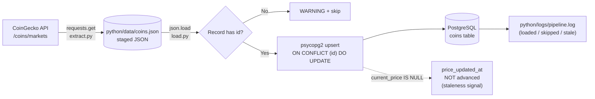

# CoinGecko ETL Pipeline

A small, dependency-light extract-and-load pipeline that pulls top
cryptocurrency market data from the CoinGecko public API and lands it into
PostgreSQL with an idempotent, null-safe upsert. The focus of the project is
data-quality robustness rather than throughput: every record survives a
partial or malformed API response without corrupting previously loaded good
data.

## Pipeline at a glance

| Stage   | Script          | Reads from              | Writes to                          |
|---------|-----------------|-------------------------|------------------------------------|
| Extract | `extract.py`    | CoinGecko `/coins/markets` | `python/data/coins.json` (JSON)    |
| Load    | `load.py`       | `python/data/coins.json` | PostgreSQL table `coins`           |

The JSON file is the handoff contract between the two stages, so each stage
can be developed, debugged, and re-run independently.

## Architecture



ASCII equivalent for terminals that do not render Mermaid:

```
[CoinGecko /coins/markets]
        |  extract.py (requests)
        v
( python/data/coins.json )   <-- staged handoff
        |  load.py (json.load + psycopg2)
        v
   id present? --no--> WARN + skip
        | yes
        v
   UPSERT ON CONFLICT (id) DO UPDATE   -->  PostgreSQL: coins
        |                                   |
        |  current_price IS NULL             +--> price_updated_at NOT advanced (staleness)
        v
   python/logs/pipeline.log   (loaded / skipped / stale per run)
```

## Design decisions

1. **Null-safe extraction.** All API fields are read with `dict.get()`, so a
   missing key yields `None` instead of a `KeyError`. A record with no `id` is
   unrecoverable (it has no stable key), so it is logged at `WARNING` and
   skipped rather than inserted with a null primary key.

2. **Upsert that never clobbers good data.** The load uses
   `INSERT ... ON CONFLICT (id) DO UPDATE SET ... = COALESCE(EXCLUDED.x, coins.x)`.
   `COALESCE` falls back to the existing column value when the incoming value
   is `NULL`, so a transiently empty API field can never overwrite a
   previously correct value.

3. **Staleness signal via `price_updated_at`.** The `price_updated_at`
   `TIMESTAMPTZ` column is advanced to `NOW()` only when a real
   `current_price` arrives (`CASE WHEN EXCLUDED.current_price IS NOT NULL`).
   A row whose timestamp lags behind its siblings therefore flags a coin for
   which the API stopped returning a price.

4. **Structured logging.** `logging.basicConfig` attaches both a
   `FileHandler` (`python/logs/pipeline.log`) and a `StreamHandler` (stdout),
   with run-level counters `loaded`, `skipped`, and `stale` emitted in a
   single summary `INFO` line at the end of every run.

5. **Retries with backoff.** `extract.py` issues its request through a
   `requests.Session` mounted with a `urllib3.Retry` adapter: up to 3 retries
   with exponential backoff on connection errors and on 429/5xx responses. A
   momentary CoinGecko hiccup no longer fails the whole run.

6. **Transactional load.** `load.py` wraps the upsert loop in `try/except` and
   calls `conn.rollback()` on any failure, so a mid-run error can't leave a
   half-applied, uncommitted transaction open against the database.

## Stack

- Python 3.14
- `requests` (HTTP), `psycopg2` (Postgres driver), `python-dotenv` (env)
- PostgreSQL 16 in Docker (container `de_postgres`, database `dedb`, role `deuser`)

## Repository layout

```
python/
├── etl/
│   ├── extract.py         # CoinGecko API  ->  staged JSON
│   ├── load.py            # staged JSON    ->  Postgres upsert
│   ├── logging_setup.py   # shared logging config for both scripts
│   ├── schema.sql         # CREATE TABLE for the coins table
│   ├── requirements.txt   # requests, psycopg2-binary, python-dotenv
│   └── test_load.py       # unit tests for the record-classification logic
├── data/
│   └── coins.json      # staged handoff between extract and load
└── logs/
    └── pipeline.log    # run log written by load.py
```

## Setup

### 1. Start PostgreSQL

```bash
docker run -d --name de_postgres \
  -e POSTGRES_DB=dedb \
  -e POSTGRES_USER=deuser \
  -e POSTGRES_PASSWORD=<your-password> \
  -p 5432:5432 \
  postgres:16
```

If the container already exists, just start it: `docker start de_postgres`.

### 2. Create the target table

From the repository root:

```bash
docker exec -i de_postgres psql -U deuser -d dedb < python/etl/schema.sql
```

### 3. Configure secrets

Create a `.env` file at the **repository root** (it is git-ignored). These are
the variable names `load.py` reads via `python-dotenv` — supply your own
values:

```dotenv
DB_HOST=
DB_PORT=
DB_NAME=
DB_USER=
DB_PASSWORD=
```

For the Docker setup above the typical values are `localhost`, `5432`,
`dedb`, `deuser`, and the password you set.

### 4. Python environment and dependencies

```bash
python3.14 -m venv .venv
source .venv/bin/activate
pip install -r python/etl/requirements.txt
```

### 5. (Optional) Override the coins pulled

`extract.py` defaults to the top 5 coins in USD. Override via env vars if
needed:

```dotenv
COINGECKO_PER_PAGE=10
COINGECKO_VS_CURRENCY=eur
```

## How to run

Run the two stages in order from the `python/etl` directory (paths are
resolved relative to each script, so the working directory does not matter):

```bash
cd python/etl
python extract.py   # writes ../data/coins.json
python load.py      # upserts into the coins table, logs to ../logs/pipeline.log
```

Re-running `load.py` is safe: the upsert makes every run converge to the
latest API state without duplicates.

## Verify results in Postgres

```bash
# Row count and most recent load
docker exec -it de_postgres psql -U deuser -d dedb -c \
  "SELECT id, name, current_price, price_updated_at FROM coins ORDER BY id;"

# Spot stale rows (price timestamp older than its siblings)
docker exec -it de_postgres psql -U deuser -d dedb -c \
  "SELECT id, price_updated_at,
          NOW() - price_updated_at AS age
   FROM coins
   WHERE price_updated_at < (SELECT MAX(price_updated_at) FROM coins)
   ORDER BY age DESC;"
```

## Review the log

```bash
# Latest run summary (loaded / skipped / stale)
tail -n 5 ../logs/pipeline.log

# All WARNING-level events (skipped records, missing prices)
grep WARNING ../logs/pipeline.log
```

A healthy run ends with a line such as:

```
... | INFO | load | Run complete: loaded=5 skipped=0 stale=0
```

## Tests

`test_load.py` covers the record-classification logic (`upsert_params`) that
decides whether a record is skipped, loaded, or flagged stale -- no database
required:

```bash
cd python/etl
pytest test_load.py -v
```

## Roadmap

- Add integration tests that exercise `load.run()` against a real (or
  containerized/test) Postgres instance, covering the COALESCE and staleness
  behavior end to end.
